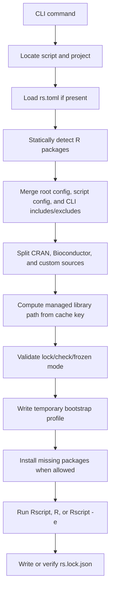

# rvx Design

`rvx` is an R-only command-line tool that brings a `uv run`-style workflow to `Rscript` and interactive R sessions.

The core idea is simple:

1. inspect an R entrypoint
2. merge detected dependencies with project config
3. materialize an isolated managed library for that dependency set
4. install anything missing
5. execute the script, shell, or inline expression inside that environment

This document describes the current design, the tradeoffs behind it, and the next steps for hardening it.

## Goals

- let users run `Rscript` with near-zero manual package bootstrapping
- keep dependency state isolated from the default user library
- support both one-off scripts and multi-script repositories
- keep the implementation small enough to maintain in Go without third-party parser dependencies
- make dependency state inspectable through `list`, `doctor`, `check`, and lockfiles

## Non-goals

- replacing `renv` for every reproducibility use case
- solving system-level dependencies such as compilers, `libxml2`, or `openssl`
- evaluating fully dynamic package loading at runtime before resolution
- becoming a general polyglot launcher; this project is intentionally R-only

## User-facing model

The tool is organized around a few workflows instead of one giant command surface:

- `rvx run <script.R>`: resolve, install if needed, then execute the script
- `rvx shell <script.R>`: open interactive `R` in the same managed environment
- `rvx exec -e '...' <script.R>`: run a one-off expression in that environment
- `rvx lock <script.R>`: install and refresh the lockfile
- `rvx check <script.R>`: validate current state against the expected plan and lockfile
- `rvx doctor <script.R>`: report setup problems before install or execution
- `rvx r <list|install|use|which>`: native interpreter-management helpers plus project-level interpreter selection
- `rvx scan <script.R>`: show the raw static dependency detection result
- `rvx list <script.R>`: show the final merged dependency plan without installing
- `rvx init`, `rvx add`, `rvx remove`: manage `rs.toml`
- `rvx cache ...`, `rvx prune`: manage cache state

This split matters because R package bootstrap has multiple distinct user questions:

- "What does this script need?"
- "What would be installed?"
- "Why is this broken?"
- "Run it now."

`scan`, `list`, `doctor`, and `check` exist so users can answer those questions without dropping straight into mutation.

## Command lifecycle

The main runtime commands all follow the same backbone:



The big design choice here is that bootstrap happens immediately before execution, not as a separate environment creation phase. That keeps the user experience close to `uv run`, where "run the thing" is also the dependency setup trigger.

## Configuration model

`rvx` looks upward from the script directory for the first `rs.toml`. That file defines project defaults, optional per-script overrides, and optional custom package sources.

Current root keys:

- `repo`
- `cache_dir`
- `lockfile`
- `rscript`
- `packages`
- `bioc_packages`

Current table shapes:

- `[sources."pkg"]`
- `[scripts."relative/path.R"]`
- `[scripts."relative/path.R".sources."pkg"]`

The merge rules are intentionally simple:

- root config defines defaults for the project
- script blocks extend package arrays and override scalar values
- script-local sources override project-wide sources with the same package key
- `rscript` can be pinned at the project or script level, and every runtime command also accepts a one-off `--rscript` override
- CLI `--include` and `--exclude` are applied after config and static detection

This gives three levels of control without introducing a heavy schema:

1. inferred dependencies from the script itself
2. checked-in project defaults in `rs.toml`
3. command-line adjustments for one-off runs

Interpreter selection follows the same layering. By default `rvx` uses `Rscript` from `PATH`. A project can pin `rscript = "..."` in `rs.toml`, one script can override that in its own block, and a single invocation can still override both with `--rscript`. The helper surface under `rvx r ...` is now first-party: it lists managed and external interpreters, installs user-local R versions, resolves an installed `Rscript` for `rvx r use`, and writes the chosen interpreter back into `rs.toml`.

For editable configs, the rewrite path now also carries lightweight formatting metadata: the top-of-file preamble is preserved, comments attached to existing sections and fields are replayed, inline trailing comments are kept, and existing root-key, top-level source/script, root-source, and script-block ordering is reused when possible. This is still intentionally modest, but it reduces unnecessary diff churn for common `rvx add` and `rvx remove` workflows. The parser now also validates malformed config more aggressively on load, surfacing section-aware line numbers, supported-key hints, and close-match suggestions for common key, type, and section-name typos. The current goal is predictable low-diff rewrites, not byte-for-byte formatting preservation for every hand-edited file.

### Why script blocks use relative paths

Per-script configuration is keyed by the path relative to the directory that contains `rs.toml`. This makes config portable across machines and avoids absolute-path churn in version control.

Example:

```toml
repo = "https://cloud.r-project.org"
cache_dir = ".rs-cache"
lockfile = "rs.lock.json"
packages = ["jsonlite"]

[scripts."scripts/report.R"]
packages = ["glue", "readr"]

[scripts."scripts/rnaseq.R"]
bioc_packages = ["DESeq2", "SummarizedExperiment"]
```

## Dependency detection

Static detection is intentionally lightweight. The scanner looks for common R package usage forms:

- `library(pkg)`
- `require(pkg)`
- `requireNamespace(pkg)`
- `pkg::fn`
- `pkg:::fn`

This is a pragmatic tradeoff:

- fast enough to run on every command
- simple enough to maintain in Go
- good enough for common scripts

It does not fully solve dynamic cases such as:

- `library(pkg_name_from_env)`
- custom loader wrappers
- dependencies constructed from strings at runtime

To keep that limitation manageable, the CLI exposes explicit escape hatches:

- `--include <pkg>`
- `--exclude <pkg>`
- `--bioc-package <pkg>`
- `--package <pkg>` on runtime commands

## CRAN, Bioconductor, and custom sources

`rs` separates install targets into three buckets:

- CRAN packages
- Bioconductor packages
- custom sources declared in config

That split exists because installation mechanisms differ:

- CRAN and Bioconductor packages come from different repository indexes
- GitHub, generic git, and local packages carry source-specific identity metadata
- the Go-native installer resolves and stages all of these source types, then uses `R CMD INSTALL` for the final install step

The project now also keeps a curated known-Bioconductor package list and uses it in detection and resolution. That means packages like `DESeq2` and `Biostrings` are treated as Bioconductor dependencies even when the user runs a script directly without an existing `rs.toml`.

## Managed library design

Installed packages do not go into the default user library. Instead, `rs` creates a managed library under a cache root:

```text
<cache>/lib/<hash>
```

The cache root can also keep a persistent package store for already-built packages:

```text
<cache>/pkgstore/<hash>
```

The hash is derived from inputs that materially affect package compatibility and installation intent, including:

- absolute script path
- resolved CRAN dependency set
- resolved Bioconductor dependency set
- selected CRAN mirror
- resolved custom source identity
- content fingerprints for `type = "local"` source files and source directories
- the current `Rscript` interpreter path
- runtime metadata such as R version, platform, architecture, OS, and package type

This design gives a few useful properties:

- repeated runs can reuse an existing library
- different scripts can have different environments without manual naming
- cache management can stay filesystem-oriented and debuggable

The package store exists to reduce rebuild churn across library hashes that target the same effective runtime and package source identity. `rs` can seed a fresh managed library from that store, reuse already-built package directories, and then sync newly installed packages back into the store with usage timestamps.

The current design still does not include every conceivable ABI-relevant dimension in the hash, but it now folds in the major runtime metadata plus local-source content fingerprints so the most obvious cross-runtime and same-path local-source reuse hazards are avoided.

## Bootstrap strategy

At runtime, `rs` writes a temporary `R_PROFILE_USER` file and launches `Rscript` or `R` with that profile injected.

The bootstrap profile is responsible for:

- prepending the managed library to `.libPaths()`
- keeping the runtime library wiring in one place before `Rscript` or `R` starts

This approach was chosen over wrapping user scripts with generated R code because it preserves normal `commandArgs()` behavior and keeps the user's script as the real entrypoint.

Package installation now happens outside that profile in the Go runtime. The native installer resolves CRAN and Bioconductor indexes, stages GitHub/git/local sources, records source metadata, and shells out to `R CMD INSTALL` for the final package build/install step. `pak` remains available as an explicit compatibility backend, but the automatic path is now native.

The runtime is also inspected explicitly before managed library selection. That lets the tool fold runtime compatibility into the cache key instead of assuming that the same dependency plan is always ABI-compatible across interpreters or platforms.

## Lockfile model

`rs.lock.json` is a snapshot of the resolved environment after a successful install or lock operation.

It records:

- script path
- selected CRAN mirror
- managed library path
- interpreter path
- runtime metadata such as R version and platform
- resolved package versions and source details
- resolved commits for GitHub or git sources when available
- stable local-source fingerprints for `type = "local"` packages

The lockfile is intentionally not a full immutable environment format yet. Instead, it acts as:

- a consistency check
- a drift detector
- an audit trail for what was installed

This is enough to support practical modes:

- `--locked`: require a matching lockfile, but allow installing the locked plan into the managed library
- `--frozen`: require both the lockfile and installed library to already match without mutation

The lock validation path now also compares architecture and OS metadata in addition to interpreter, R version, platform, and package type. For local sources, it also compares the current content fingerprint against the lockfile instead of relying on path equality alone. That closes an earlier gap where the lockfile could distinguish more state than the validator actually enforced.

## Diagnostics model

The tool has multiple diagnostic layers because R dependency failures can happen at different stages.

`scan` answers:

- what packages were found in the script text?

`list` answers:

- after config and CLI adjustments, what is the resolved plan?

`doctor` answers:

- is the machine ready to attempt this operation?

`check` answers:

- does the current lock and installed environment match expectations?

This separation is deliberate. It makes the tool easier to automate and easier to debug in CI, because users can choose the cheapest command that answers the question they actually have.

### Structured diagnostics

The inspection commands now expose richer structure than the initial prototype:

- `rvx check --json` keeps the flat `issues` array for compatibility, but also splits failures into `input_issues` and `installed_issues`
- installed-library drift is further grouped into `installed_missing_packages`, `installed_version_issues`, `installed_source_issues`, and `installed_other_issues`
- `rvx check --json` also includes `installed_issue_details`, which gives machine-readable `kind`, `package`, `field`, and `message` values so automation does not need to parse free-form text
- `rvx doctor --json` keeps flat `warnings` and `errors`, and also groups them into `setup_errors`, `source_errors`, `network_errors`, `runtime_errors`, `lock_warnings`, and `cache_warnings`
- `rvx doctor --json` also includes `error_details` and `warning_details`, which give machine-readable `category`, `kind`, `message`, and optional path/package/env metadata
- `rvx doctor --json` also includes `next_steps`, a structured list of suggested follow-up actions with `category`, `kind`, `message`, optional `command`, and a `blocking` flag
- `rvx doctor --json` also includes top-level `status` plus a `summary` object with aggregate counts so CI can short-circuit on the report state without re-counting every bucket

The human-readable error path was also tightened. Validation failures now distinguish:

- missing lockfiles
- lockfile input drift
- installed-library drift

For installed-library drift, the text output includes grouped summaries such as missing packages, version mismatches, and source mismatches, then points to `rvx cache rm <managed-library>` or `rvx lock` as the likely next step.

The doctor command now follows the same philosophy. Human-readable output prints `[next]` lines after warnings, errors, and system hints, while JSON callers can read the same suggestions from `next_steps` instead of scraping prose.

For stricter automation, `rvx doctor --strict` promotes any non-`ok` report into a non-zero exit. That keeps the JSON payload the same, but lets CI enforce policies like "warning-free environment required" without reimplementing exit logic outside the tool. The current convention is exit code `1` for ordinary doctor errors and exit code `2` for strict-mode warning failures.

## `rvx shell`

`rvx shell` exists because many R workflows are exploratory. After a script's dependency plan is resolved, opening an interactive session in the same managed environment is often the fastest way to inspect data, test package availability, or reproduce a runtime issue.

From a design standpoint, `shell` is not a separate environment type. It reuses the same resolver, cache key, bootstrap profile, and managed library as `run`.

## `rvx init`

`rvx init` exists to turn an ad hoc script into a checked-in project quickly.

Important behaviors in the current design:

- `--from <script>` seeds config from a scanned script
- `--from-dir <dir>` scans a tree of scripts
- bundled base and recommended packages are filtered by default
- known Bioconductor packages are moved into `bioc_packages`
- one scanned script writes root-level arrays by default
- multiple scanned scripts write per-script blocks automatically

This keeps onboarding lightweight for both single-script and multi-script repositories.

## Cache management

The cache is explicitly user-visible because hidden mutation tends to make language tools harder to trust.

Current cache commands support:

- printing the cache root
- listing managed libraries and persistent package-store entries
- pruning stale managed libraries plus old or empty package-store entries
- removing one managed library or package-store entry by hash or explicit managed path

Safety rules are intentionally strict. Deletion only applies to directories that match the managed `<cache>/lib/<16-hex>` or package-store `<cache>/pkgstore/<64-hex>` layouts.

## Why Go

The implementation is in Go for a few practical reasons:

- easy single-binary distribution
- strong standard library support for filesystem and process orchestration
- fast startup for "inspect first, maybe install, then run"
- a straightforward fit for CLI and config tooling

The tradeoff is that the TOML parser and R scanner are currently minimal and purpose-built rather than feature-complete.

## Known limitations

- `rs.toml` rewrite preservation is intentionally conservative and still does not guarantee byte-for-byte formatting stability
- static scanning is not perfect for dynamic package loading
- system package prerequisites are not solved
- the current lockfile is strong enough for drift detection, not full reproducibility
- generic runtime/source summaries are now stronger, but some mismatch classes are still represented as strings rather than fully typed schema everywhere

## Example layouts

The repository includes example projects that map directly to the design:

- [`examples/cran-basic/`](../examples/cran-basic): one script, CRAN-only dependencies
- [`examples/bioc-rnaseq/`](../examples/bioc-rnaseq): Bioconductor-heavy script
- [`examples/multi-script/`](../examples/multi-script): one `rs.toml`, multiple script profiles

These examples are a good sanity check for future changes: if a new command or config change makes these layouts awkward, the design has probably become too complicated.

## Next steps

The most useful next improvements are:

1. tighten `rs.toml` rewrite fidelity in edge cases such as exact blank-line placement
2. broaden mixed-source drift coverage and older-library metadata compatibility checks
3. surface better system dependency hints in `doctor`
4. add more explicit lockfile refresh policies
5. improve custom source verification for immutable GitHub and git revisions
